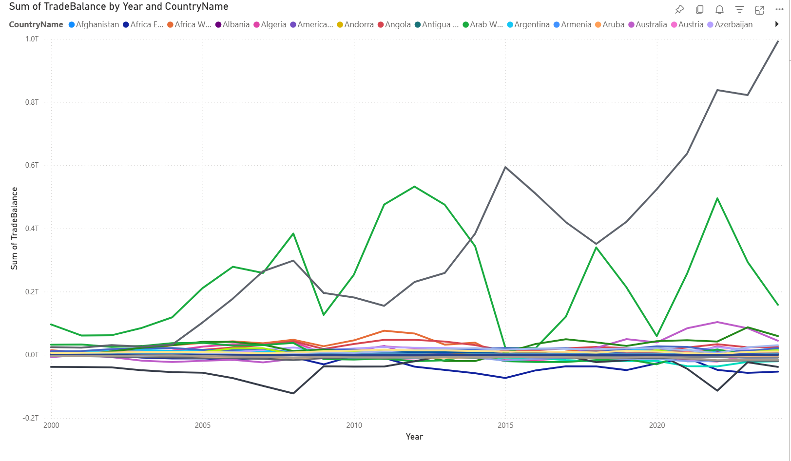
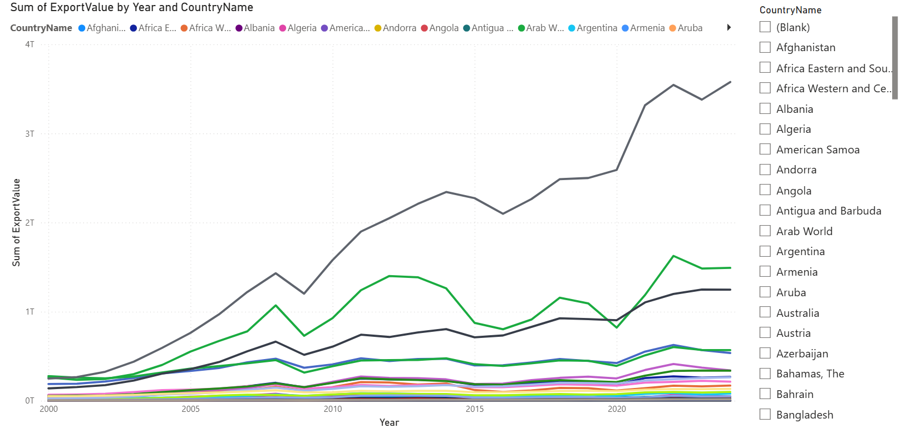
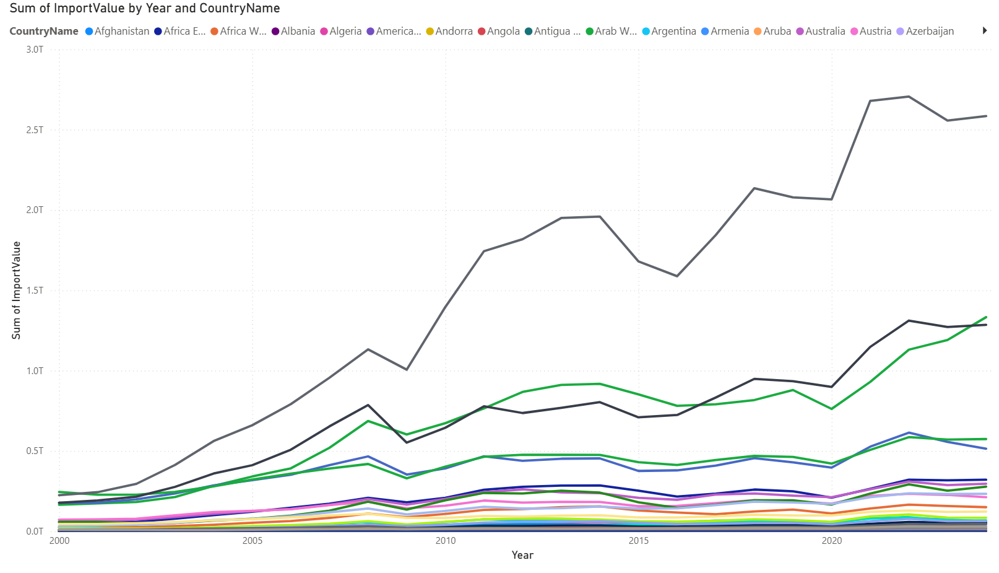

# World Bank Trade Analysis - Microsoft Fabric Portfolio

## Overview
Analysis of global merchandise trade (exports and imports) trends 
across 266 countries using Microsoft Fabric Warehouse.

## Objective
To build a scalable data pipeline that transforms global trade data 
into actionable insights, visualizing the impact of geopolitical 
and economic events on trade performance.

## Data Source
- World Bank Open Data: Merchandise exports (current US$)
- World Bank Open Data: Merchandise imports (current US$)
- Period: 2000-2024

## Architecture
Medallion Architecture (Bronze / Silver / Gold)

### Bronze
- Raw CSV files from World Bank

### Silver
- T-SQL UNPIVOT: Wide format → Long format
- Data type conversion

### Gold
- dimCountry
- dimYear
- factTrade (ImportValue / ExportValue / TradeBalance)

## Pipeline
- Copy Data × 2 (imports + exports → staging)
- Stored Procedure (MERGE for incremental load)
- Fully automated end-to-end pipeline

## Tools & Technologies
- Microsoft Fabric Warehouse
- T-SQL / UNPIVOT / MERGE
- Data Pipeline
- Power BI (Time series line chart + Slicer)

## Visualization

## Data Model

## Pipeline Design

## Key Finding
- Arab countries show significant trade dips in 2008, 2015, 
  and 2020, closely reflecting global oil price fluctuations.
- Arab countries' trade remains low in 2025, potentially 
  reflecting ongoing geopolitical risks including Strait of 
  Hormuz tensions.
- US exports continued to grow despite geopolitical tensions 
  with China.
- China shows the highest export growth among all countries 
  from 2000 to 2024.
