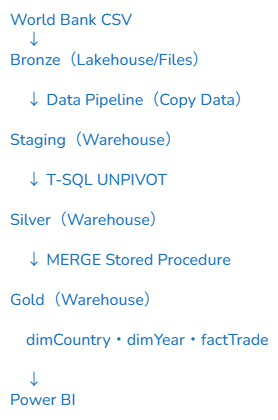
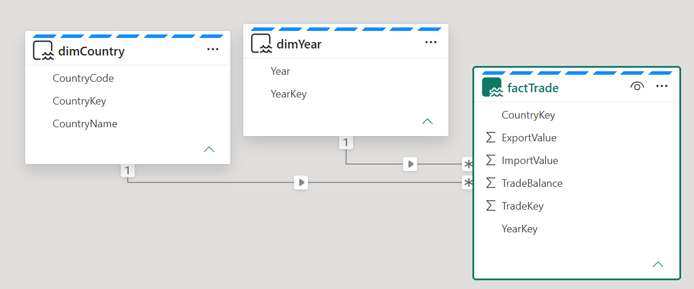
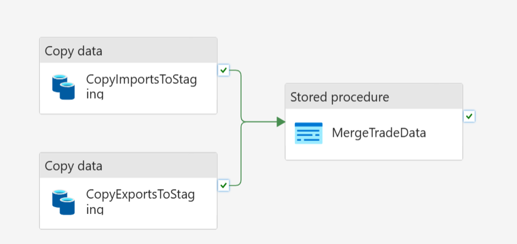

🇬🇧 English version → [README.md](README.md)

# 世界銀行 貿易データ分析 - Microsoft Fabric ポートフォリオ

## 概要

Microsoft Fabric Warehouseを使用して、266カ国の商品貿易データ（輸出・輸入）をデータウェアハウスアーキテクチャで分析したデータエンジニアリングプロジェクトです。

### 使用技術

Microsoft Fabric Warehouse | Data Factory | T-SQL | Power BI

## 目的

Microsoft Fabricを活用した貿易データ分析基盤の設計・構築。データ取得からトランスフォーメーション、ディメンショナルモデリング、レポーティングまでを一貫して実装しました。

## データソース

- World Bank Open Data：商品輸出額（現在価格、米ドル）
- World Bank Open Data：商品輸入額（現在価格、米ドル）
- 対象期間：2000年〜2024年

## アーキテクチャ

メダリオンアーキテクチャ（Bronze / Silver / Gold）

### Bronze

- 世界銀行からダウンロードした生CSVファイルをそのまま格納

### Silver

- T-SQL UNPIVOTによる横持ち→縦持ち変換
- データ型変換

### Gold

- dimCountry（国マスタ）
- dimYear（年マスタ）
- factTrade（輸入額・輸出額・貿易収支）

## パイプライン

- Copy Data × 2（輸入・輸出データをステージングへ取込）
- ストアドプロシージャ（MERGEによる差分ロード）
- 取得からロードまで完全自動化したエンドツーエンドパイプライン

## 技術的なポイント

- Microsoft Fabricを用いて、生データの取得からPower BIレポートまで一貫したデータ基盤を設計・構築
- Microsoft Fabric Warehouseにメダリオンアーキテクチャ（Bronze / Silver / Gold）を実装
- Data FactoryのCopy Dataアクティビティを活用した自動データ取込パイプラインを構築
- T-SQL UNPIVOTを用いて世界銀行の横持ちデータを縦持ち形式に変換
- スタースキーマのデータモデル（dimCountry・dimYear・factTrade）を設計・実装
- T-SQL MERGEストアドプロシージャによる差分ローディングを開発
- ディメンショナルモデリングとGoldレイヤーのデータ整備により、スケーラブルな分析レポーティングを実現

## ビジュアライゼーション

## データモデル

## パイプライン設計

## 分析から得られた知見

- アラブ諸国では2008年・2015年・2020年に貿易量の大幅な落ち込みが見られ、世界的な原油価格の変動と密接に連動しています。
- 一部のアラブ諸国では、2024年時点でも貿易活動がコロナ前の水準を下回っており、地政学的不確実性の影響が続いている可能性があります。
- アメリカは中国との地政学的な緊張にもかかわらず、輸出額は増加傾向を維持しています。
- 中国は2000年から2024年にかけて、全対象国の中で最も高い輸出成長率を示しました。
